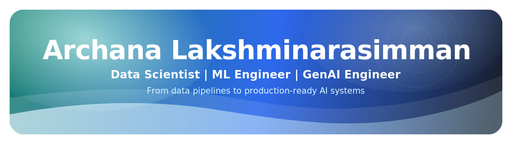

  

  
  
  
  
  

  <strong>Master's in Engineering Data Science @ University of Houston</strong>
   
  Open to Data Science, ML Engineering, GenAI, and Analytics Engineering opportunities

---

## About Me

I enjoy turning messy, open-ended data problems into systems that people can actually use. For me, that usually means going beyond model building into data cleanup, pipeline design, evaluation, dashboards, and delivery.

My background sits at the intersection of software engineering, analytics, and applied AI. I have worked on transaction monitoring systems in fintech, NLP workflows in biomedical research, and large-scale institutional analytics, which has made me especially interested in practical, production-facing machine learning.

I am currently pursuing my Master's in Engineering Data Science at the University of Houston with a 4.0 GPA. I am most excited by opportunities in data science, ML engineering, GenAI, and analytics engineering where strong technical work translates into clear business or user impact.

## Quick Highlights

| Area | Highlights |
| --- | --- |
| Experience | 6+ years across analytics, machine learning, and production software |
| Projects | 7+ end-to-end projects spanning NLP, forecasting, analytics, and AI systems |
| Organizations | 4+ organizations across enterprise, healthcare, research, and academia |
| Location | Houston, Texas |

## Recent Experience

- **Research Assistant - Data Analyst**, Office of Institutional Research, University of Houston  
  Built executive-facing dashboards and analyzed 2M+ records to support planning and decision-making across the university.  
  `Power BI` `Tableau` `SQL` `SAS` `Python`

- **Machine Learning Research Intern**, Baylor College of Medicine  
  Developed NLP and embedding workflows across 120K+ omics records and reduced manual curation effort by 45%.  
  `Python` `R` `GPT-4.1` `Gemini` `NLP` `Embeddings`

- **Associate Product Engineer**, Temenos India Pvt. Ltd.  
  Shipped 5 transaction monitoring solutions and helped improve quality in regulated banking environments.  
  `Java` `Temenos T24` `JBase` `SQL`

- **Data Science Intern**, Mindteck India Pvt. Ltd.  
  Created ML models and ETL pipelines that reached 82% accuracy while cutting reporting effort by 60%.  
  `Python` `scikit-learn` `ETL` `Supervised Learning`

## Selected Projects

- **AI-Assisted Investing**  
  Created an equity research workflow that combines feature engineering, stock ranking, backtesting, and optional RAG-based insight generation.

- **AI Agent for Intelligent Job Search and Resume Optimization**  
  Built a single-agent LLM workflow that filters job postings, ranks strong matches, and adapts resume content for specific roles.

- **Multimodal Crime Report Analyzer**  
  Developed a modular analysis pipeline that processes evidence from audio, documents, images, text, and video before combining the results.

- **Abstractive News Summarization with BART and Mistral**  
  Developed a long-form news summarization pipeline using transformer models, LoRA fine-tuning, and evaluation-driven iteration.

- **News Category Classification with BERT and RoBERTa**  
  Fine-tuned BERT and RoBERTa models for news classification with careful preprocessing and side-by-side model comparison.

- **Flight Fare Prediction**  
  Trained regression models on historical U.S. airline pricing data to forecast fares and identify the strongest price drivers.

- **Chemicals in Beauty Industry Analysis Dashboard**  
  Designed a Tableau dashboard to explore hazardous chemical reporting in beauty products, including yearly volume, YoY change, and hazard patterns.

## What I Work With

- **Data & Analytics:** Data analysis, business intelligence, dashboard development, SQL and query optimization
- **AI & Machine Learning:** Applied ML, generative AI, RAG, agents, NLP, model evaluation and validation
- **Data Engineering:** ETL, data pipelines, workflow automation, backend systems, APIs, Docker
- **Modeling & Experimentation:** Statistical analysis, experiment design, predictive modeling

## Tools & Technologies

### Programming

  
  
  
  

### Databases

  
  
  

### Data & Visualization

  
  
  
  

### AI / Machine Learning

  
  
  
  
  
  
  

### Data Engineering & Cloud

  
  
  
  
  

### Collaboration

  
  
  

## Education

- **University of Houston**  
  Master's in Engineering Data Science, August 2024 - May 2026  
  GPA: 4.0 / 4.0

- **PSG Institute of Technology and Applied Research**  
  Bachelor's in Computer Science and Engineering, August 2016 - May 2020  
  GPA: 3.6 / 4.0

## Let's Connect

I am open to roles and collaborations across data science, applied AI, machine learning, and analytics engineering.

- Portfolio: [archana-ai.vercel.app](https://archana-ai.vercel.app)
- Resume: [resume.pdf](https://archana-ai.vercel.app/resume.pdf)
- LinkedIn: [archana-lakshminarasimman](https://www.linkedin.com/in/archana-lakshminarasimman/)
- GitHub: [ArchanaLakshminarasimman](https://github.com/ArchanaLakshminarasimman)
- Email: [archana.lakshminarasimman@gmail.com](mailto:archana.lakshminarasimman@gmail.com)

  

